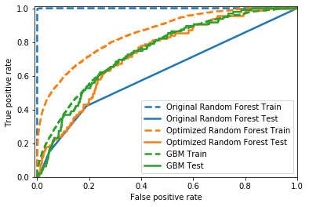

# Machine Learning Engineer Candidate Project Solution

This repository is forked from the
[phData Machine Learning Engineer Candidate Project](https://github.com/phdata/mle-project-challenge)
repository.
Please head over there for a complete description of the problem statement.

In short, the tasks are to:
1) Deploy a pre-trained machine learning model as a REST API
2) Make improvements to the model using data-science techniques


## Solution Overview

### Task One: Deploy the model

The model is deployed as a Flask web service.  The external API has only one
method: `predict()`.
Users can submit a JSON-formatted POST request containing the model-input
features and receive predictions back.

Behind the scenes, the service is factored into two components:
the external API and an internal service that tracks and returns the most
up-to-date serialized model as a blob.  Factoring in this way
allows the external API to remain running when deploying a new version
of the model to the internal model service.

The internal model service is yet another Flask application.
It is possible that an open-source data server could serve this purpose well;
however, writing a custom application allowed implementation of desired
validation features without combing through documentation for
an external library.

For this prototype, the internal model service pulls the model from a
read-only Docker volume.
In a production setting, a different object store would be recommended, such
as one from a cloud provider, e.g. Amazon S3.

The services run in docker containers, launched locally using docker-compose.
To scale the service, these containers could be deployed using Kubernetes
or a managed container service from a cloud provider.

To run in Docker Desktop, the services are configured in `docker-compose.yml`.
The Dockerfiles and python code for the services can be found in the
`services` directory.

### Task Two: Improve the model

This task was completed somewhat hastily and the code is still sloppy.
The code from `predict-late-payers-basic-model.py` was pasted into
`improve_model.ipynb` and adapted slightly.
A summary is provided below to reduce the need to read the notebook carefully.

Overview of model-improvement effort:
* A quick exploration of the features and labels was added.
* Accuracy was not a good metric.  This dataset has extreme class imbalance, and the predicted late-payer scores rarely, if ever, rise above the default 50% threshold.  Even precision and recall won't tell much.  To better evaluate performance, we look at ROC-AUC; this can be interpreted as the probability that two randomly-sampled predictions are ranked appropriately.  Given that model predictions will be used to compare lending opportunities, interpreting ROC in its probablistic sense seems appropriate.
* Based on the metric above, the hyperparameters of the original random-forest model was optimized using a cross-validated grid search.  This improved ROC-AUC score on the test set, but the train and test set were still out of line, indicating poor generalization.
* A gradient-boosted classifier was trained with default parameters since these models generally work well out of the box.  The ROC-AUC on the test set slightly outperformed the optimized random-forest model, but was much closer to that of the train set.  This suggests an improvement in the generalization of the probability scores output by the model.



### Shortcomings

* The service doesn't have any sort of load balancing.  Truly scaling
the service would require multiple instances of the containers on a cluster
and appropriate request routing.
* The service doesn't have any external logging.  In a real deployment,
it is absolutely necessary to log predictions and
also monitor system errors on a scaleable logging platform.
* There could be a more testing in this repository.  The internal model service
has some unit tests, but the prediction service doesn't, and there
should be a lot more in the way of integration tests.
* Using a docker volume as an object store for the model is a cheap hack.
In a complete solution, this should be a more robust storage option.
* Using Miniconda as the base container image was a weird choice.  It seemed
attractive based on the ability to configure packages via neat YAML files, but conda
always seems to add unnecessary cruft and the documentation isn't great.
* There isn't any web interface or anything to demo predictions,
that would have been neat to implement.

## Running this code

### Generate the original model

Unpack the zip archive with the data, build the conda environment, and run
`predict-late-payers-basic-model.py`.
Requires Anaconda to be installed.

```bash
unzip data/peerLoanData.zip -d data/
conda env create -f env-setup/conda_environment.yml
source activate loanModel
python predict-late-payers-basic-model.py
```

### Start the services

Start the services with Docker Compose.
Requires Docker Desktop.

```bash
docker-compose up --build -d
```

You can send a request to the server using `make_test_request.py`.

```bash
python make_test_request.py
```

### Build the and analyze improved models

Start a jupyter notebook server and use the loanModel conda environment
to run the notebook.
This is a pain in the butt of a process, I know.

### Deploy a new model

Modify the model service in `docker-compose.yml` with a new
file name and model hash.
Then relaunch the only the model service, while keeping the
external prediction service running:

```
docker-compose up -d --build model
```

### Shut down the service

```bash
docker-compose down
```
